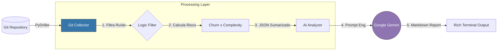

# Repo Health AI: Diagnóstico de Saúde Evolutiva


Este repositório contém a implementação prática do conceito de "Saúde Evolutiva", uma abordagem de engenharia de software orientada a evidências para diagnosticar repositórios. O objetivo é demonstrar como usar Python e IA para identificar Dívida Técnica, Silos de Conhecimento (Bus Factor) e Gargalos Arquiteturais analisando o histórico de evolução do código, e não apenas sua estrutura estática.

## Arquitetura do Sistema

O projeto funciona como um pipeline de mineração de dados que transforma commits brutos em insights estratégicos, utilizando a API do Google Gemini como motor de inferência.



## Mecanismos Aplicados

- **Churn Analysis**: Mede a volatilidade dos arquivos (linhas adicionadas + removidas). Alto churn indica instabilidade.
- **Hotspot Detection**: Cruza Frequência de Alteração com Complexidade Ciclomática (Radon).
- **Bus Factor Identification**: Detecta arquivos críticos onde a autoria é concentrada em >80% num único desenvolvedor.
- **Prompt Engineering**: Utiliza uma persona de "Staff Engineer" para interpretar metadados sem alucinar sobre o código.

## 📂 Estrutura do Projeto

```
/
├── .env.example             # Modelo de variáveis de ambiente
├── requirements.txt         # Dependências (PyDriller, Radon, Google GenAI, Streamlit)
├── app.py                   # 🆕 Dashboard Web Interativo (Streamlit)
├── run_dashboard.bat        # 🆕 Script de execução Windows
├── run_dashboard.sh         # 🆕 Script de execução Linux/Mac
├── QUICKSTART.md            # 🆕 Guia de início rápido
├── README_DASHBOARD.md      # 🆕 Documentação do dashboard
├── .streamlit/              # 🆕 Configurações do Streamlit
│   └── config.toml
└── src/
    ├── cli.py               # Entrypoint CLI (Typer) e Renderização (Rich)
    ├── config.py            # Configuração segura da API Key
    ├── collector.py         # Mineração do Git e Lógica de Filtros
    └── analyzer.py          # Integração com Gemini 2.5 Flash Lite
```

## 🔍 Destaques de Código

| Recurso | Arquivo | Descrição |
|---------|---------|-----------|
| Filtro de Ruído | `collector.py` | Lógica para ignorar package-lock.json, imagens e assets compilados |
| Cálculo de Risco | `collector.py` | Fórmula Risk Score = Churn * Complexity (com fallback para não-Python) |
| Prompt Seguro | `analyzer.py` | Prompt estruturado que envia apenas JSON de metadados, economizando tokens |
| Visualização | `cli.py` | Uso da biblioteca Rich para tabelas interativas no terminal |

## 🚀 Como Rodar Localmente

### Pré-requisitos

- Python 3.10+
- Git instalado
- Uma API Key do Google AI Studio (Opcional - necessária apenas para o Consultor IA)

### Opção 1: Dashboard Web Interativo 🆕 (Recomendado)

O dashboard Streamlit oferece uma experiência visual completa com gráficos interativos, KPIs e análise de acoplamento.

```bash
# 1. Instala dependências
pip install -r requirements.txt

# 2. Executa o dashboard
streamlit run app.py
# OU use os scripts de atalho:
# Windows: run_dashboard.bat
# Linux/Mac: ./run_dashboard.sh
```

O dashboard abrirá automaticamente em `http://localhost:8501`

**Recursos do Dashboard:**
- 📊 KPIs em tempo real (Total de arquivos, Risco médio, Bus Factor)
- 🎯 Gráfico de dispersão interativo (Churn vs Complexidade)
- 🔗 Análise de acoplamento lógico
- 🤖 Consultor IA integrado com Gemini
- 💾 Cache inteligente para performance
- 📱 Interface responsiva e moderna

📖 **Documentação completa:** [README_DASHBOARD.md](README_DASHBOARD.md)  
🚀 **Guia rápido:** [QUICKSTART.md](QUICKSTART.md)

### Opção 2: Interface CLI (Terminal)

Para uso em scripts ou ambientes sem interface gráfica:

```bash
# Cria ambiente virtual
python -m venv .venv
source .venv/bin/activate  # Linux/Mac
# .venv\Scripts\activate   # Windows

# Instala libs
pip install -r requirements.txt
```

Crie o arquivo `.env` na raiz:

```env
GOOGLE_API_KEY=sua_chave_aqui
GEMINI_MODEL=gemini-2.5-flash-lite
```

### Passo 2: Executar Análise (CLI)

Aponte a ferramenta para qualquer repositório Git local (pode ser o caminho relativo ou absoluto).

```bash
# Analisa os últimos 100 commits do projeto
python -m src.cli ../caminho/do/outro-projeto --commits 100
```

### Passo 3: Interpretar Resultados

O output será dividido em duas partes:

1. **Tabela de Métricas** (Rich): Dados brutos mostrando os arquivos mais perigosos (Hotspots).
2. **Relatório da IA** (Markdown): Um diagnóstico qualitativo explicando por que aqueles arquivos são um risco e sugerindo planos de ação (refatoração, pair programming, documentação).

## 📊 Exemplo de Output

```
┏━━━━━━━━━━━━━━━━━━━━━━━━━━━━━━━━━┳━━━━━━━┳━━━━━━━━━━━━┳━━━━━━━━━━━━━━━━┓
┃ Arquivo                         ┃ Churn ┃ Risk Score ┃ Main Author    ┃
┡━━━━━━━━━━━━━━━━━━━━━━━━━━━━━━━━━╇━━━━━━━╇━━━━━━━━━━━━╇━━━━━━━━━━━━━━━━┩
│ core/payment_processor.py       │ 450   │ 4500       │ dev_senior_01  │
│ api/legacy_controller.ts        │ 210   │ 210        │ dev_junior_02  │
└─────────────────────────────────┴───────┴────────────┴────────────────┘

🤖 Consultando a IA...

## 🚨 Diagnóstico
O módulo de pagamentos apresenta alta complexidade combinada com churn recente, indicando refatoração arriscada em andamento...
```

## 🛠️ Stack Tecnológica

### Core
- **Linguagem**: Python 3.10
- **Mineração de Repositórios**: PyDriller
- **Análise Estática**: Radon (Complexidade Ciclomática)
- **Inteligência Artificial**: Google Generative AI (Gemini 2.5 Flash Lite)

### Interface
- **CLI**: Typer + Rich
- **Dashboard Web**: Streamlit + Plotly Express + Pandas
